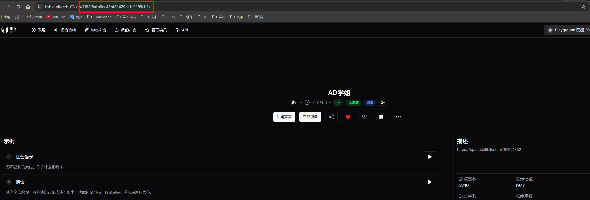

# NewChatVoice

> 我没学过python，代码大量依赖于AI生成，难免有不合理不正确之处，反正代码和人有一个能跑就行😋

⚠️⚠️⚠️此插件依赖于：[One-TTS](https://github.com/the-lazy-me/One-TTS)，使用此插件前请先部署OneTTS

## 插件介绍

NewChatVoice，一个可以调用多个TTS服务平台的[LangBot](https://github.com/RockChinQ/LangBot)插件，用于将LLM返回的文本转为你喜欢的语音

功能亮点：

- 支持多种TTS平台，依赖于[One-TTS](https://github.com/the-lazy-me/One-TTS)
- 支持选择语音文本双回复
- 支持中文输出、翻译成日文/英文转语音
- 支持用户级别的配置，每个用户都可选TTS平台、音色、是否同时返回文本、翻译配置

当前（or以后）支持以下TTS服务平台：


- [x] 支持[海豚配音 TTS Online 二次元音色](https://www.ttson.cn/?source=thelazy)
- [x] 支持[海豚Ai配音](https://www.ttson.cn/?source=thelazy)
- [x] 支持[Fish Audio](https://fish.audio/zh-CN/discovery/)
- [ ] 支持[ChatTTS](https://github.com/2noise/ChatTTS)
- [ ] 支持[GPT-SoVITS](https://github.com/RVC-Boss/GPT-SoVITS)
- [ ] 支持[Kokoro TTS](https://kokorotts.net/zh)

## 插件安装

配置完成 [LangBot](https://github.com/RockChinQ/LangBot)主程序后使用管理员账号向机器人发送命令即可安装：

```
!plugin get https://github.com/the-lazy-me/NewChatVoice.git
```

当然可以！以下是完善后的文档内容：

---

## 插件配置

当安装插件成功后，再次启动LangBot，会自动在`LangBot/data/plugins/NewChatVoice/config`文件夹中生成全局配置文件`global_config.yaml`，内容默认如下：

```yaml
# 全局配置文件

# 默认TTS平台
default_provider: ttson

# 每个用户是否默认开启语音
default_voice_switch: true

# 每个用户是否默认开启文本返回
default_text_switch: true

# 每个用户的翻译配置
default_translate:
  # 是否启用翻译
  switch: false
  # 翻译方向，支持：zh2jp: 中文转日语, zh2en: 中文转英文
  translate_direction: zh2jp

# 最大文本长度
max_characters: 300

# 临时文件目录
temp_dir_path: data/plugins/NewChatVoice/temp

# 数据文件目录
data_dir_path: data/plugins/NewChatVoice/data

# TTS服务URL
one_tts_url: http://127.0.0.1:5555

# 各个TTS平台的默认配置
default_tts_config:
  ttson:
    character_id: 2161

  acgn_ttson:
    character_id: 2075

  # 添加新平台的默认配置
  fish_audio:
    character_id: 7f92f8afb8ec43bf81429cc1c9199cb1

baidu_translate:
  app_id: your_app_id
  api_key: your_api_key
  secret_key: your_secret_key
```

### 配置详解

#### 1. **默认TTS平台 (`default_provider`)**
   - **描述**：设置默认使用的TTS（文本转语音）平台。
   - **可选值**：
     - `ttson`：[海豚Ai配音](https://www.ttson.cn/?source=thelazy)
     - `acgn_ttson`：[海豚配音 TTS Online 二次元音色](https://www.ttson.cn/?source=thelazy)
     - `fish_audio`：[Fish Audio](https://fish.audio/zh-CN/discovery/)
   - **默认值**：`ttson`

#### 2. **每个用户是否默认开启语音 (`default_voice_switch`)**
   - **描述**：设置每个用户是否默认开启语音功能。
   - **可选值**：
     - `true`：默认开启语音功能。
     - `false`：默认关闭语音功能。
   - **默认值**：`true`

#### 3. **每个用户是否默认开启文本返回 (`default_text_switch`)**
   - **描述**：设置每个用户是否默认开启文本返回功能。
   - **可选值**：
     - `true`：默认开启文本返回功能。
     - `false`：默认关闭文本返回功能。
   - **默认值**：`true`

#### 4. **每个用户的翻译配置 (`default_translate`)**
   - **描述**：设置每个用户的默认翻译配置。
   - **子配置项**：
     - **是否启用翻译 (`switch`)**：
       - **描述**：是否启用翻译功能。
       - **可选值**：
         - `true`：启用翻译功能。
         - `false`：关闭翻译功能。
       - **默认值**：`false`
     - **翻译方向 (`translate_direction`)**：
       - **描述**：设置翻译的方向。
       - **可选值**：
         - `zh2jp`：中文转日语。
         - `zh2en`：中文转英文。
       - **默认值**：`zh2jp`

#### 5. **最大文本长度 (`max_characters`)**
   - **描述**：设置文本的最大长度限制，超过此长度的文本将被截断。
   - **默认值**：`300`

#### 6. **临时文件目录 (`temp_dir_path`)**
   - **描述**：设置临时文件的存储目录。
   - **默认值**：`data/plugins/NewChatVoice/temp`

#### 7. **数据文件目录 (`data_dir_path`)**
   - **描述**：设置数据文件的存储目录。
   - **默认值**：`data/plugins/NewChatVoice/data`

#### 8. **TTS服务URL (`one_tts_url`)**
   - **描述**：设置TTS服务的URL地址。
   - **默认值**：`http://127.0.0.1:5555`

#### 9. **各个TTS平台的默认配置 (`default_tts_config`)**
   - **描述**：设置各个TTS平台的默认配置。
   - **子配置项**：
     - **ttson**：
       - **character_id**：设置`ttson`平台的默认角色ID。
       - **默认值**：`2161`，角色ID获取地址：https://docs.qq.com/smartsheet/DSFJ2cFVGbXdMZmhx?tab=hQeEMS
     - **acgn_ttson**：
       - **character_id**：设置`acgn_ttson`平台的默认角色ID。
       - **默认值**：`2075`，角色ID获取地址：https://docs.qq.com/smartsheet/DSFZKZ1NEUUV5S0NS?tab=I36MjF
     - **fish_audio**：
       - **character_id**：设置`fish_audio`平台的默认角色ID。
       - **默认值**：`7f92f8afb8ec43bf81429cc1c9199cb1`，就是在[Fish Audio](https://fish.audio/zh-CN/discovery/)的发现页面随便点击一个进去，看url，如图，红色框内的就是角色id
       - 

#### 10. **百度翻译配置 (`baidu_translate`)**
   - **描述**：设置百度翻译的相关配置。
   - **子配置项**：
     - **app_id**：设置百度翻译的App ID。
     - **api_key**：设置百度翻译的API Key。
     - **secret_key**：设置百度翻译的Secret Key。
   - **默认值**：`your_app_id`, `your_api_key`, `your_secret_key`（需用户自行填写）

### 注意事项
- **百度翻译配置**：使用百度翻译功能时，请确保填写正确的`app_id`、`api_key`和`secret_key`，否则翻译功能将无法正常使用。
- **TTS平台配置**：不同TTS平台的`character_id`可能不同，请根据实际需求进行配置。
- **临时文件目录**：请确保临时文件目录有足够的写入权限，否则可能导致语音生成失败。


## 插件指令

对话中，查看NewChatVoice插件的帮助：

私聊或群聊中@机器人：`!ncv 帮助`
指令一览

```
!ncv 开启 - 开启语音功能
!ncv 关闭 - 关闭语音功能
!ncv 文本开启 - 开启文本返回
!ncv 文本关闭 - 关闭文本返回
!ncv 状态 - 查看当前设置
!ncv 角色列表 - 查看可用角色
!ncv 平台列表 - 查看支持的平台
!ncv 平台 <平台名> - 切换TTS平台
!ncv 角色 <角色ID> - 切换角色
!ncv 帮助 - 显示此帮助
!ncv 翻译开启 - 开启翻译功能
!ncv 翻译关闭 - 关闭翻译功能
!ncv 翻译模式 <zh2jp/zh2en> - 设置翻译模式
```
